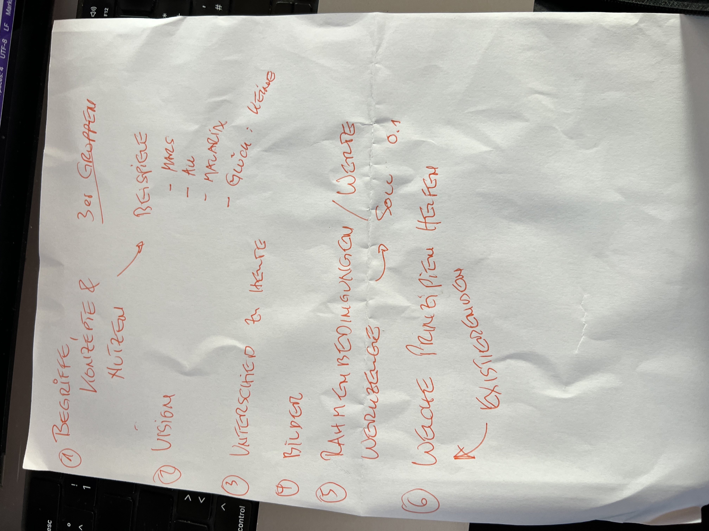

Extract the Text from 
# GPT Response (model: gpt-4o-2024-05-13, system: default)
## Extracted Text

1. Begriffe, Konzepte & Nutzen
   3er Gruppen

   Beispiele:
   - Hans
   - Ali
   - Mararia
   - Glück: keine

2. Vision

3. Unterschied zu heute

4. Bilder

5. Rahmenbedingungen / Werte

   Werkzeuge → Soll 0.1

6. Welche Prinzipien helfen
   Existierenson

# User Response
